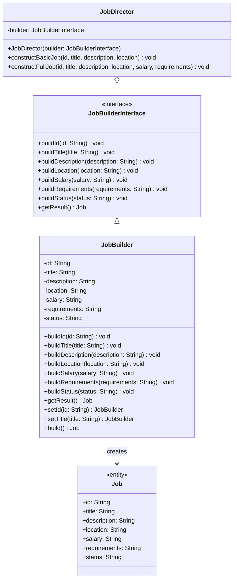
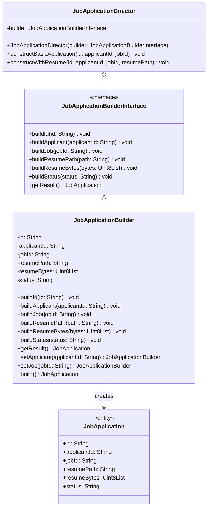

```mermaid
classDiagram
    class JobBuilderInterface {
        <<interface>>
        +buildId(id: String) void
        +buildTitle(title: String) void
        +buildDescription(description: String) void
        +buildLocation(location: String) void
        +buildSalary(salary: String) void
        +buildRequirements(requirements: String) void
        +buildStatus(status: String) void
        +getResult() Job
    }
    
    class JobBuilder {
        -id: String
        -title: String
        -description: String
        -location: String
        -salary: String
        -requirements: String
        -status: String
        +buildId(id: String) void
        +buildTitle(title: String) void
        +buildDescription(description: String) void
        +buildLocation(location: String) void
        +buildSalary(salary: String) void
        +buildRequirements(requirements: String) void
        +buildStatus(status: String) void
        +getResult() Job
        +setId(id: String) JobBuilder
        +setTitle(title: String) JobBuilder
        +build() Job
    }
    
    class JobDirector {
        -builder: JobBuilderInterface
        +JobDirector(builder: JobBuilderInterface)
        +constructBasicJob(id, title, description, location) void
        +constructFullJob(id, title, description, location, salary, requirements) void
    }
    
    class Job {
        <<entity>>
        +id: String
        +title: String
        +description: String
        +location: String
        +salary: String
        +requirements: String
        +status: String
    }
    
    JobBuilderInterface <|.. JobBuilder
    JobDirector o-- JobBuilderInterface
    JobBuilder ..> Job : creates
```

```mermaid
    classDiagram
    class JobApplicationBuilderInterface {
        <<interface>>
        +buildId(id: String) void
        +buildApplicant(applicantId: String) void
        +buildJob(jobId: String) void
        +buildResumePath(path: String) void
        +buildResumeBytes(bytes: Uint8List) void
        +buildStatus(status: String) void
        +getResult() JobApplication
    }
    
    class JobApplicationBuilder {
        -id: String
        -applicantId: String
        -jobId: String
        -resumePath: String
        -resumeBytes: Uint8List
        -status: String
        +buildId(id: String) void
        +buildApplicant(applicantId: String) void
        +buildJob(jobId: String) void
        +buildResumePath(path: String) void
        +buildResumeBytes(bytes: Uint8List) void
        +buildStatus(status: String) void
        +getResult() JobApplication
        +setApplicant(applicantId: String) JobApplicationBuilder
        +setJob(jobId: String) JobApplicationBuilder
        +build() JobApplication
    }
    
    class JobApplicationDirector {
        -builder: JobApplicationBuilderInterface
        +JobApplicationDirector(builder: JobApplicationBuilderInterface)
        +constructBasicApplication(id, applicantId, jobId) void
        +constructWithResume(id, applicantId, jobId, resumePath) void
    }
    
    class JobApplication {
        <<entity>>
        +id: String
        +applicantId: String
        +jobId: String
        +resumePath: String
        +resumeBytes: Uint8List
        +status: String
    }
    
    JobApplicationBuilderInterface <|.. JobApplicationBuilder
    JobApplicationDirector o-- JobApplicationBuilderInterface
    JobApplicationBuilder ..> JobApplication : creates
    
```