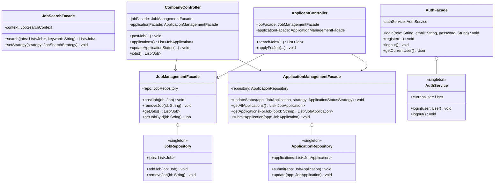

```mermaid
classDiagram
    class JobManagementFacade {
        -repo: JobRepository
        +postJob(job: Job) void
        +removeJob(id: String) void
        +getJobs() List~Job~
        +getJobById(id: String) Job
    }
    
    class ApplicationManagementFacade {
        -repository: ApplicationRepository
        +updateStatus(app: JobApplication, strategy: ApplicationStatusStrategy) void
        +getAllApplications() List~JobApplication~
        +getApplicationsForJob(jobId: String) List~JobApplication~
        +submitApplication(app: JobApplication) void
    }
    
    class JobSearchFacade {
        -context: JobSearchContext
        +search(jobs: List~Job~, keyword: String) List~Job~
        +setStrategy(strategy: JobSearchStrategy) void
    }
    
    class AuthFacade {
        -authService: AuthService
        +login(role: String, email: String, password: String) void
        +register(...) void
        +logout() void
        +getCurrentUser() User
    }
    
    class CompanyController {
        -jobFacade: JobManagementFacade
        -applicationFacade: ApplicationManagementFacade
        +postJob(...) void
        +applications() List~JobApplication~
        +updateApplicationStatus(...) void
        +jobs() List~Job~
    }
    
    class ApplicantController {
        -jobFacade: JobManagementFacade
        -applicationFacade: ApplicationManagementFacade
        +searchJobs(...) List~Job~
        +applyForJob(...) void
    }
    
    class JobRepository {
        <<singleton>>
        +addJob(job: Job) void
        +removeJob(id: String) void
        +jobs: List~Job~
    }
    
    class ApplicationRepository {
        <<singleton>>
        +submit(app: JobApplication) void
        +update(app: JobApplication) void
        +applications: List~JobApplication~
    }
    
    class AuthService {
        <<singleton>>
        +login(user: User) void
        +logout() void
        +currentUser: User
    }
    
    JobManagementFacade o-- JobRepository
    ApplicationManagementFacade o-- ApplicationRepository
    AuthFacade o-- AuthService
    CompanyController --> JobManagementFacade
    CompanyController --> ApplicationManagementFacade
    ApplicantController --> JobManagementFacade
    ApplicantController --> ApplicationManagementFacade
```