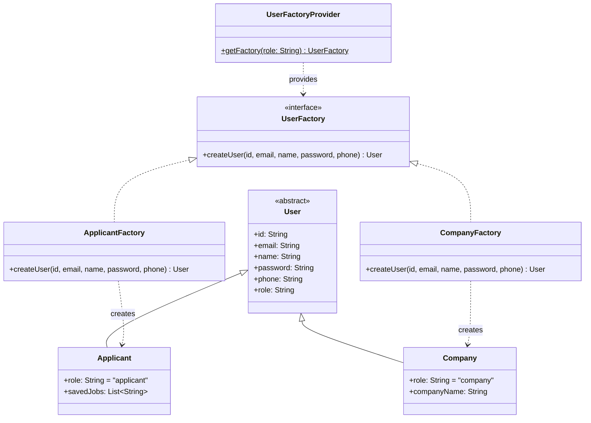

```mermaid
classDiagram
    class UserFactory {
        <<interface>>
        +createUser(id, email, name, password, phone) User
    }
    
    class ApplicantFactory {
        +createUser(id, email, name, password, phone) User
    }
    
    class CompanyFactory {
        +createUser(id, email, name, password, phone) User
    }
    
    class UserFactoryProvider {
        +getFactory(role: String)$ UserFactory
    }
    
    class User {
        <<abstract>>
        +id: String
        +email: String
        +name: String
        +password: String
        +phone: String
        +role: String
    }
    
    class Applicant {
        +role: String = "applicant"
        +savedJobs: List~String~
    }
    
    class Company {
        +role: String = "company"
        +companyName: String
    }
    
    UserFactory <|.. ApplicantFactory
    UserFactory <|.. CompanyFactory
    UserFactoryProvider ..> UserFactory : provides
    User <|-- Applicant
    User <|-- Company
    ApplicantFactory ..> Applicant : creates
    CompanyFactory ..> Company : creates
```

