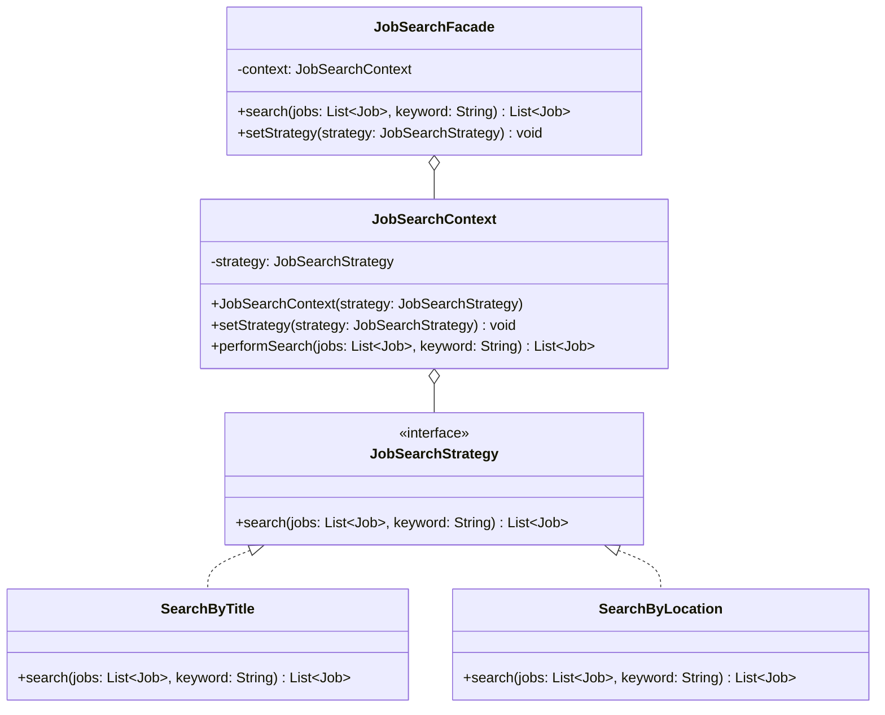
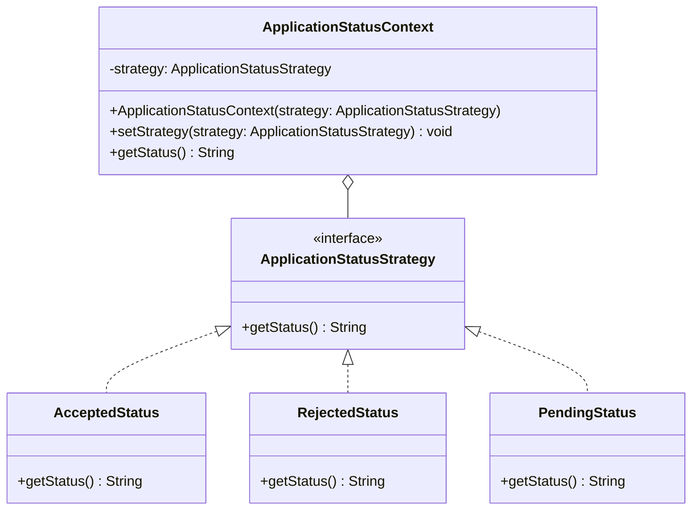

## Job Search Strategy

```mermaid
classDiagram
    class JobSearchStrategy {
        <<interface>>
        +search(jobs: List~Job~, keyword: String) List~Job~
    }
    
    class SearchByTitle {
        +search(jobs: List~Job~, keyword: String) List~Job~
    }
    
    class SearchByLocation {
        +search(jobs: List~Job~, keyword: String) List~Job~
    }
    
    class JobSearchContext {
        -strategy: JobSearchStrategy
        +JobSearchContext(strategy: JobSearchStrategy)
        +setStrategy(strategy: JobSearchStrategy) void
        +performSearch(jobs: List~Job~, keyword: String) List~Job~
    }
    
    class JobSearchFacade {
        -context: JobSearchContext
        +search(jobs: List~Job~, keyword: String) List~Job~
        +setStrategy(strategy: JobSearchStrategy) void
    }
    
    JobSearchStrategy <|.. SearchByTitle
    JobSearchStrategy <|.. SearchByLocation
    JobSearchContext o-- JobSearchStrategy
    JobSearchFacade o-- JobSearchContext
```

---

## Application Status Strategy

```mermaid
classDiagram
    class ApplicationStatusStrategy {
        <<interface>>
        +getStatus() String
    }
    
    class AcceptedStatus {
        +getStatus() String
    }
    
    class RejectedStatus {
        +getStatus() String
    }
    
    class PendingStatus {
        +getStatus() String
    }
    
    class ApplicationStatusContext {
        -strategy: ApplicationStatusStrategy
        +ApplicationStatusContext(strategy: ApplicationStatusStrategy)
        +setStrategy(strategy: ApplicationStatusStrategy) void
        +getStatus() String
    }
    
    ApplicationStatusStrategy <|.. AcceptedStatus
    ApplicationStatusStrategy <|.. RejectedStatus
    ApplicationStatusStrategy <|.. PendingStatus
    ApplicationStatusContext o-- ApplicationStatusStrategy
```
